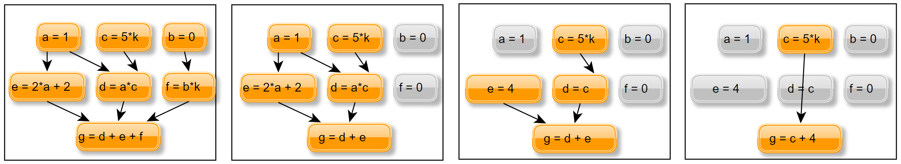

Analysis
========

Introduction
------------

The equations generated by the processing module are unsuitable for the
calculation process. The generated system of equation has many equations which
are not useful to calculate the outputs of the system. Outputs are the values
you are interested in. In the case of PyMbs these are usually sensors. An
example for equations that are easy to simplify are variables that are zero/one
or equal to another variable.  The goal is to speed up the calculation by
reducing the effort. The effort can be reduced by an analyses of the system of
equations on the equation level and the system level.  The resulting system of
equations contains only the essential steps to calculate the outputs. Take for
example this graph

The corresponding system of equations is

.. math::
  :label: system-large

	  a &= 1\\
	  b &= 0\\
	  c &= 5 \cdot k\\
	  d &= a \cdot c\\
	  e &= 2 \cdot a + 2\\
	  f &= b \cdot k\\
	  g &= d + e + f

with the output :math:`g`. Seven steps needed to calculate :math:`g`. In order
to reduce the system all zeros are eliminated.  The second step is to do the
same for all variables equal one. The last step is to replace all variables
used only once. The resulting system of equations reads as follows

.. math::
    :label: system-small

    c &= 5 \cdot k\\
    g &= c + 4

Now, only two steps are required to calculate :math:`g`.

Furthermore an abstract syntax tree of the system of equations is useful to
calculate the dimensions from all variables and to sort the equations.  Not all
supported languages and corresponding simulation tools are able to derive the
dimension of an variable from the equation. To sort the equations is necessary
because not all supported simulation tools are able to do this.  Note, that the
implemented algorithm is not able to handle loops in the system of equations.
For example the given system of equations

.. math::
    :label: system-loop

    a &= 5\\
    b &= c + 2a\\
    c &= b + a \\
    d &= b + c

contains a loop for the variables :math:`b` and :math:`c`.  The methods used in
implementing the aforementioned tasks are described in the next section.

Generating the Abstract Syntax Tree
-----------------------------------

The input from the Analysis Layer is a list of Expression objects. These
objects have the following important information.

* The name of the variable called *symbol*, which represents the left hand side
  of the expression.
* The equation, which is the right hand side of the expression.

All information is stored in an node of the abstract syntax tree. A list of all
required variables for each node can be generated using the symbolics module.
With the list of required variables from each node the edges of the tree can be
constructed. To store the edges, every node has two list. One for the parent
nodes and one for the child nodes. A parent node is a node which is used to
calculate the expression of the node. In addition a global list of all nodes
exists to avoid to iterate through the tree when searching nodes.

Reducing the System of Equation
-------------------------------

The reduce algorithm has to find all nodes, which are

#. equal to zero or one or
#. have only one parent.

Because this is one of the main parts of the analysing module it should work
efficient and fast.

The algorithm for the first point is divided in the following four steps.  The
first step is to find all nodes with no parents to extract all constants.  This
can be done simple by looking on the list of parents from each node.  The
second step is to check whether the node is replaceable. Not all nodes are
replaceable, for example parameters or sensors should not disappear. To decide
whether a node is replaceable or not categories were established. There are
categories for state variables, parameter variables or sensor variables. The
third step is to check whether the node is equal to one or zero. If this
conditions is true the last step starts and replaces the node in the equations
of the children and rearranges the abstract syntax tree by removing the
corresponding edges. After this changes it is possible that a child node
equation becomes equal to zero or one. Also this node should be replaced to
obtain an equation system that is suitable for calculating the outputs
efficiently. These four steps are executed recursively for each child node.

The algorithm for the second point looks similar to the algorithm for the first
point.  The difference is that this algorithm does not work recursively.  The
algorithm is executed for each node of the global list of nodes.

Obtaining Sorted Equations
--------------------------

To sort the equations the nodes within the abstract syntax tree have to be
marked with a level of depth. The level of depth is the longest path from a
child to parent with no parents. This is done by a recursive algorithm that is
executed for a list of nodes. The first list contains all nodes with no parent
node.  The level of depth is default set to zero for each node. This means all
nodes have the same level of depth. The algorithm starts and tries to increase
the level of depth for all children from a node of the list. If the level of
depth of a child is not increased, the algorithm takes the next node from the
list. The level of depth can be increased if the new value is greater than the
old one. In addition this algorithm is used to find loops inside the system of
equations. Therefore each node has a flag that indicates if the node has been
checked. If the flag is active and it will be visited again a loop is detected
and an error message is thrown. If the level of depth is set for all nodes the
next step is to collect all nodes according to the desired category. Therefore
a loop runs through the global list of nodes and collects the required nodes in
a list. The next step is to collect all parents from the nodes inside the list.
This is done by an recursive algorithm and a following loop. The recursive
algorithm gets the list of required nodes.  It steps through all parents of the
nodes and sets the required flag. Afterwards the loop checks the global list of
nodes and collects all nodes with active *required* flag.  With the list of all
required nodes the third step starts to arrange the required nodes in a way
that every expression of a node can be calculated. Therefore every variable
inside the expression has to be calculated beforehand. This problem is solved
by the level of depth. All nodes with equal level of depth are collected inside
one list.  Afterwards the lists are ordered by increasing level of depth and
concatenated.  The last step is to calculate the dimension of each expression
and collect the expressions in a list according to the sequence.

Calculating Value and Dimension of an Equation
----------------------------------------------

For some layers there is a need to know the dimension of a variable.  For
example models designed in Modelica or C-code need the dimension for a
variable.  To get the dimension of a variable the expression need to be
evaluated. To evaluate a expression all variables need to be known. This
process is done recursively until a expression can be evaluated because it is a
constant.  The expression is evaluated using the symbolics module, which also
returns the dimension of each variable.
