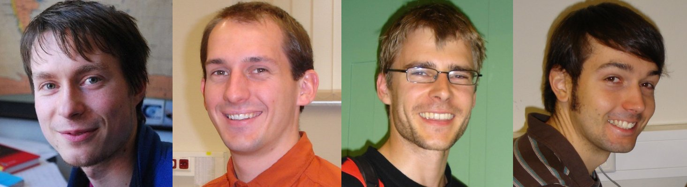

About
=====

PyMbs has originally been developed at Dresden University of Technology at the
Institute of Processing Machines and Mobile Machinery by a questing quartet:

    Carsten Knoll & Christian Schubert & Jens Frenkel & Sebastian Voigt

`Chair of Construction Machines and Conveying Technology <https://tu-dresden.de/ing/maschinenwesen/imd/bm>`_

`Chair of Control Theory <http://www.et.tu-dresden.de/rst/>`_

* carsten(d)knoll(a)tu(min)dresden(d)de

We started working on PyMbs in July 2009, as we faced the need of a
convenient way to obtain the equations of motion of complex mechanical
systems to feed a real time simulation environment based on the Modelica
modelling language. By the release of PyMbs 0.1 these aim could be achieved.

Finally `OpenModelica <https://openmodelica.org>`_ supported multibody
simulation out of the box and should be used if you want to have something
just working. However PyMbs was still used for research regarding efficient
simulation of large systems and symbolic manipulation of systems of equation.

Today PyMbs is still used in real-life engineering projects, especially
in cases where:

* commercial multibody software is just over the top
* commercial multibody software can't handle a certain problem efficiently
* the problem itself is not too complex but a lot of automation and processing
  is involved - this is where PyMbs and Python shine
* low level access to the equations of motion is required
* the environment (programming language) does not support multibody simulation
* PyMbs' symbolic capabilities are "misused", e.g. to generate explicit
  equations for sensors within a system

So PyMbs will hardly get new major features, but it is constantly maintained to
work with latest Python and dependencies.

If you face any problems using PyMbs, feel free to file an issue on
`GitHub <https://github.com/sevoigt/pymbs>`_.
